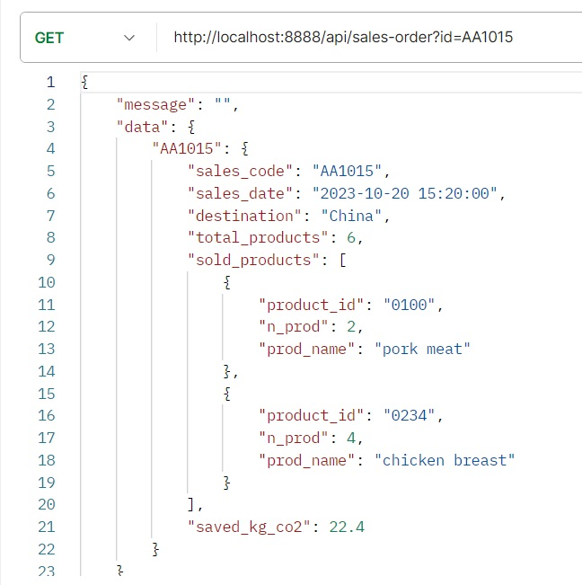
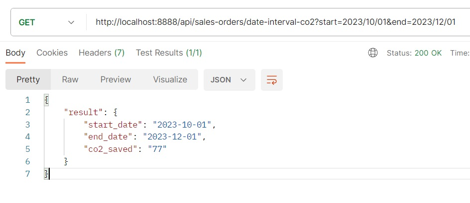
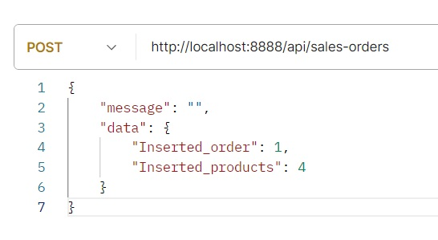
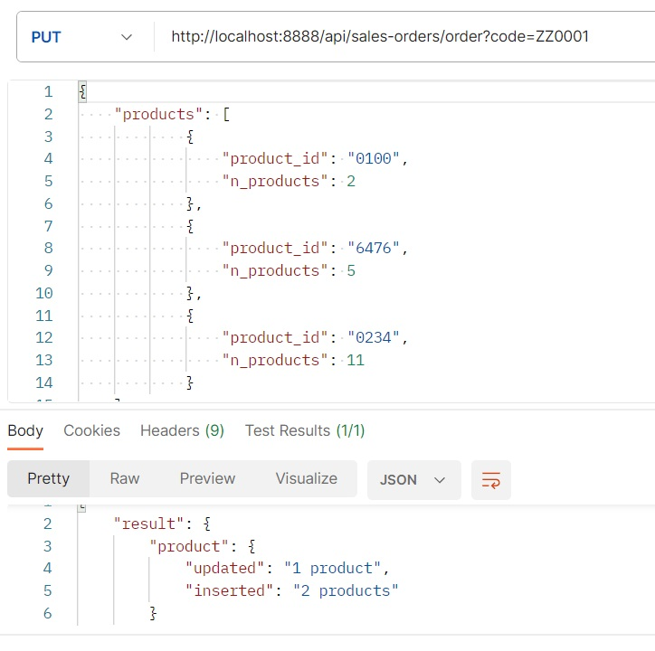
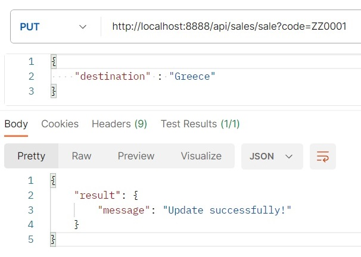
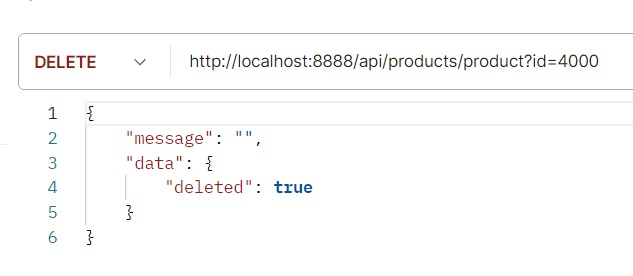
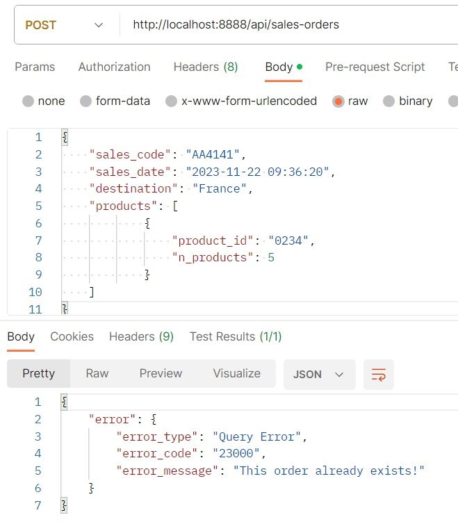
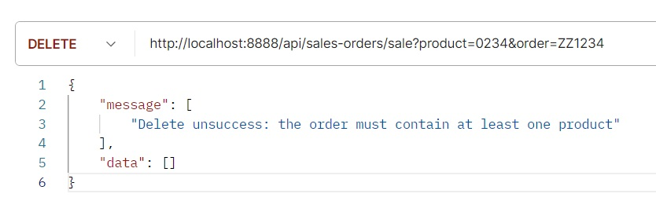

# API per co2 risparmiata dalle vendite

## **Prerequisiti:**

### - Per l'utilizzo:

* Specifico front-end per la visualizzazione dei dati.
* Software come Postman che permetta di effettuare richieste ad API.

### - Per lo sviluppo:

* Aver installato PHP e MySql ( es. XAMPP )
* installare `composer` come dependecy manager
* avviare `composer` con il comando:
    
        composer install

* creare apposito file `.ENV` per l’accesso al DB

		Immettere i propri dati nel file .ENV
        
		DB_NAME=kreas
		DB_USER=[username]
        DB_PASSWORD=[password]
        DB_HOST=[host]		// es. Localhost -> 127.0.0.1

* per visualizzare gli errori, commentare le 3 righe di codice indicate nel file `error-handler.php` nella cartella `./core`.

 

## **Linguaggi utilizzati:** 

* PHP, MySql.

## **Scopo:** 

* Fornire API per gestione dei dati nel database.
* Ricevere i dati filtrati.

 

# **Organizzazione dei file:** 

## File `index.php`:

* Richiama tutte le funzioni e file necessari per la connessione al db, prende i dati della URI , richiama `routes.php`, ridireziona il traffico verso il controller specifico

## File `config.php`:

* Crea la configurazione per la connessione al DB utilizzando i dati di accesso presenti in `.ENV`

## Cartella `./app`

* Contiene il file `routes.php`, il quale crea un vero e proprio registro dove vi sono i dati di routing.

* Contiene la cartella `./controllers` con i controller che tramite funzioni dedicate, si occupano di gestire i dati e caricare le risorse necessarie.

* La cartella `./models` contenente le entità con i loro metodi specifici che vanno a richiamare per ogni richiesta la query opportuna.

## La cartella `./core` contiene:

* La cartella `database` contenente `Connection.php` che si occupa di instaurare la connessione vera e propria al DB, il file `QueryBuilder.php` contenente le query specifiche del DB. 

* `ApiFunctions.php` -> Ha tutte le funzioni utili per effettuare controlli e determinate azioni atte a processare i dati.

* `App.php` -> Consente di memorizzare e prendere dati in un registro

* `bootstrap.php` -> incaricata a creare una connessione al DB passando la configurazione a `Connection.php

* `Response.php` -> è una classe che permette di restituire la risposta in formato json.

* `Request.php` -> è una classe che permette di estrarre i dati dalla URI.

* `Router.php` -> Crea la tabella di routing partendo da `routes.php` e smista il traffico verso il controller dedicato con la sua funzione `direct()`.

 

# Utilizzo delle API

## Richieste “GET” lettura dati

### Lettura dei prodotti:

    GET -> {domain}/api/products/all
    GET -> {domain}/api/product/{id}

### Lettura ordine completo:

    GET -> {domain}/api/sales-orders/all
    GET -> {domain}/api/sales-order/{id}

 

#### Esempio lettura ordine:
 
 

### Ricavare dati da un ordine di vendita:

* Ricavare il totale di tutta la co2 risparmiata da tutte le vendite:
    
        GET ->
        {domain}/api/sales-orders/all-co2

* Ricavare il totale della co2 risparmiata in un determinato intervallo di tempo:
    
        GET ->
        {domain}/api/sales-orders/date-interval-co2?start={start}&end={end}

    #### **N.B.** Lasciando vuoti uno dei due campi `{start}` o `{end}` verranno automaticamente rimpiazzati con la data odierna

     

    
    
     

* Ricavare il totale della co2 risparmiata da tutte le vendite verso un certo paese di destinazione:

        GET ->
        {domain}/api/sales-orders/destination-co2?country={country}   

* Ricavare il totale della co2 risparmiata da uno specifico prodotto:
		
        GET ->
        {domain}/api/sales-orders/product-co2?product={id}

 

## Richieste “POST” inserimento dati:

### Inserimento di un nuovo prodotto:

		POST -> {domain}/api/products
        
### Corpo della richiesta: 
    {
        "product_code": "4000",
        "name": "meat",
        "saved_kg_co2":"6"
    }

 

### Inserimento di un nuovo ordine:
	
    	POST -> {domain}/api/sales-orders

### Corpo della richiesta: 

    {
        "sales_code": "ZZ1234",
        "sales_date": "2023-11-22",
        "destination": "France",
        "products": [
            {
                "product_id": "0100",
                "n_products": "2"
            },
            {
                "product_id": "1345",
                "n_products": "3"
            },
            {
                "product_id": "6476",
                "n_products": "2"
            },
            {
                "product_id": "5520",
                "n_products": 3
            }
        ]
    } 

 

### Inserimento di un nuovo prodotto in un ordine già esistente:
	
    	POST -> {domain}/api/sales-orders/sale?order={code}

### Corpo della richiesta: 

    {     
        "product_id": "5520",        
        "n_products" : 4
    }

 

## Richieste “PUT” modifica dei dati:

### **N.B** Per tutte le richieste `PUT` è possibile immettere uno o più campi da modificare. Non è necessario rinserire dati che non si vuole modificare.

### Modifica di un prodotto:

		PUT -> {domain}/api/products/product?id={value}

#### esegue l'update del prodotto con il codice = {value}

### Corpo della richiesta: 

    {
        "product_code": "4141",
        "name": "Chicken hamburger",
        "saved_kg_co2":"10.3"
    }

 

### Modifica di un ordine di vendita:

		PUT -> {domain}/api/sales-orders/order?id={value}

#### esegue l'update dell’ordine con il codice = {value}

#### Corpo della richiesta: 

    {
        "sales_code": "ZZ1235",
        "sales_date": "2023-11-25 16:00:00",
        "destination": "Canada",
        "products": [
                {
                    "product_id": "0100",
                    "n_products": 2
                }
        ]
    }

#### Se si vuole lasciare tutto invariato e modificare solo i prodotti nell'ordine è possibile fare in questo modo:

 

### Modifica info ordine:

#### Si può effettuare la modifica delle informazioni di vendita senza andare a specificare i prodotti con:

		PUT -> {domain}/api/sales/sale?id={value} 

#### specificando uno o più campi nel corpo della richiesta

    {
        "sales_code": "ZZ0001",
        "sales_date" : "2023-11-30 16:30:00",
        "destination" : "Italy"
    }

#### O semplicemente modificare solo il paese di destinazione

    {
        "destination": "Greece",
    }

 

## Richieste “DELETE” cancellazione dei dati:

### Cancellazione di un prodotto:

		DELETE -> {domain}/api/products/product?id={value}

#### esegue il delete del prodotto con il codice = {value}

 

### Cancellazione di un ordine di vendita:

		DELETE -> {domain}/api/sales/sale?id={value} 

#### esegue il delete dell’ordine con il codice = {value}

 

### Cancellazione di un singolo prodotto nell'ordine di vendita: 

		DELETE -> {domain}/api/sales-orders/sale?product={p_code}&order={o_code}  

#### esegue il delete del prodotto con il codice `{p_code}` e codice ordine `{o_code}`

 

## Possibili errori

### Ordine già esistente:

 

### Non è possibile eliminare tutti i prodotti nell'ordine:

 

# **Di più:**

### Per informazioni aggiuntive consultare il file: `how-to-use.txt`

# **Link utili:**

### - [Sito personale (portfolio)](https://giovannipacelli2.github.io/portfolio/)

### - [Breve presentazione](./presentation/Presentazione_API.pdf)