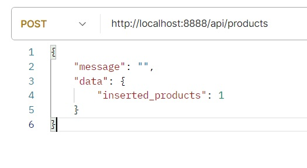

# API per co2 risparmiata dalle vendite

## **Prerequisiti:**

### - Per l'utilizzo:

* Specifico front-end per la visualizzazione dei dati.
* Software come Postman che permatta di effettuare richieste ad API.

### - Per lo sviluppo:

* Aver installato PHP e MySql ( es. XAMPP )
* installare composer come dependecy manager
* creare apposito file .ENV per l’accesso al DB

		Immettere i propri dati nel file .ENV
        
		DB_USER=[username]
        DB_PASSWORD=[password]
        DB_HOST=[host]		// es. Localhost -> 127.0.0.1

 

## **Linguaggi utilizzati:** 

* PHP, MySql.

## **Scopo:** 

* Fornire API per gestione dei dati nel database.
* Ricevere i dati filtrati.

 

# **Organizzazione dei file:** 

## Cartella `./api`

### In questa cartella vi è il cuore dell’app:

* Contiene il file `index.php`, il quale ricava i dati dall’URI e reindirizza verso l’operazione desiderata utilizzando la funzione contenuta in `file-renderer.php` che a sua volta utilizza lo schema in `routes.php`

* Contiene `./product` e `./sales-order` che sono le due cartelle che contengono i file che si occupano di effettuare le azioni.

## La cartella `./config` contiene:

* Il file `./api_config/routes.php` dove ci sono le regole per lo smistamento. 

* Il file `db_config.php` che crea la configurazione per la connessione al DB utilizzando i dati di accesso presenti in `.ENV`

## La cartella `./core` contiene:

* `Message` -> incaricata a visualizzare messaggi
* `ApiFunctions` -> Tutte le funzioni utili per effettuare controlli e determinate azioni atte a processare i dati
* `UriBuilder` -> costruisce un “oggetto” partendo dall’URI
* `Connection` -> Instaura la connessione al DB partendo da una determinata configurazione.

## La cartella `./model` contiene le classi che sono astrazione dei modelli:

### `Product` e `Sale`  ->  Ognuno con i suoi metodi **CRUD** e funzioni per le query.

 

# Utilizzo delle API

## Richieste “GET” lettura dati

### Ricavare tutti i prodotti o tutti gli ordini:

    GET -> {domain}/api/products/all
    GET -> {domain}/api/sales-orders/all

