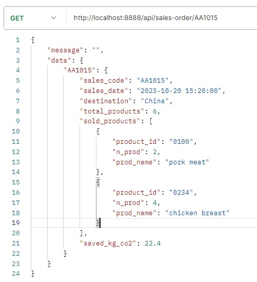
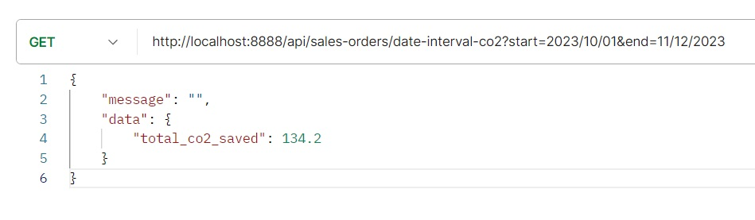
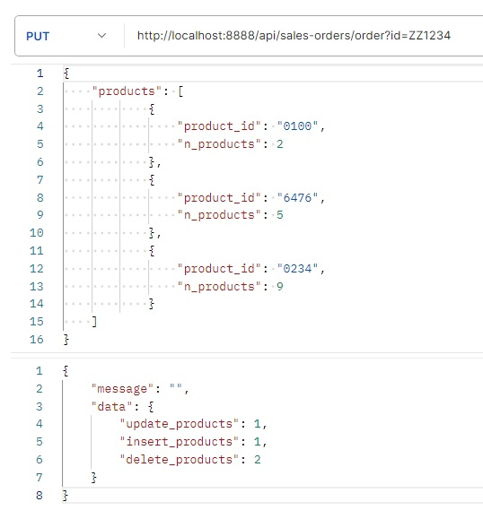
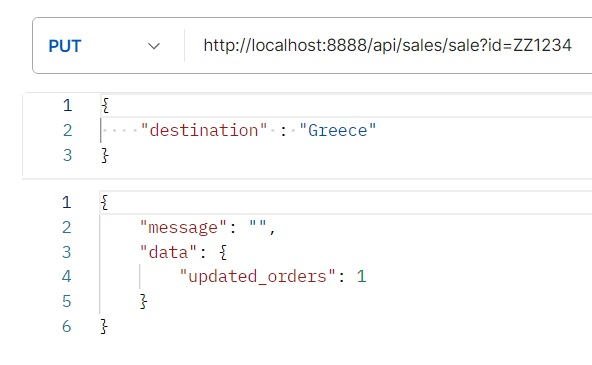
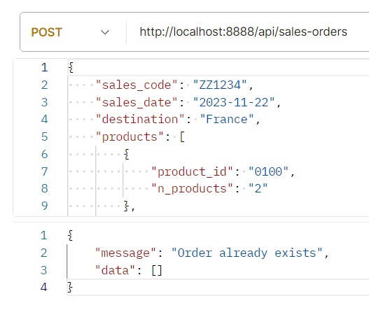

# API per co2 risparmiata dalle vendite

## **Prerequisiti:**

### - Per l'utilizzo:

* Specifico front-end per la visualizzazione dei dati.
* Software come Postman che permetta di effettuare richieste ad API.

### - Per lo sviluppo:

* Aver installato PHP e MySql ( es. XAMPP )
* installare `composer` come dependecy manager
* avviare `composer` con il comando:
    
        composer install

* creare apposito file `.ENV` per l’accesso al DB

		Immettere i propri dati nel file .ENV
        
		DB_NAME=kreas
		DB_USER=[username]
        DB_PASSWORD=[password]
        DB_HOST=[host]		// es. Localhost -> 127.0.0.1

 

## **Linguaggi utilizzati:** 

* PHP, MySql.

## **Scopo:** 

* Fornire API per gestione dei dati nel database.
* Ricevere i dati filtrati.

 

# **Organizzazione dei file:** 

## Cartella `./api`

### In questa cartella vi è il cuore dell’app:

* Contiene il file `index.php`, il quale ricava i dati dall’URI e reindirizza verso l’operazione desiderata utilizzando la funzione contenuta in `file-renderer.php` che a sua volta utilizza lo schema in `routes.php`

* Contiene `./product`, `./sale` e `./sales-order` che sono le cartelle che contengono i file che si occupano di effettuare le azioni.

## La cartella `./config` contiene:

* Il file `./api_config/routes.php` dove ci sono le regole per lo smistamento. 

* Il file `db_config.php` che crea la configurazione per la connessione al DB utilizzando i dati di accesso presenti in `.ENV`

## La cartella `./core` contiene:

* `Message` -> incaricata a visualizzare messaggi
* `ApiFunctions` -> Tutte le funzioni utili per effettuare controlli e determinate azioni atte a processare i dati
* `UriBuilder` -> costruisce un “oggetto” partendo dall’URI
* `Connection` -> Instaura la connessione al DB partendo da una determinata configurazione.

## La cartella `./model` contiene le classi che sono astrazione dei modelli:

#### `Product`, `Sales` e `SalesOrder`  ->  Ognuno con i suoi metodi **CRUD** e funzioni per le query.

 

# Utilizzo delle API

## Richieste “GET” lettura dati

### Lettura dei prodotti:

    GET -> {domain}/api/products/all
    GET -> {domain}/api/products/{id}

### Lettura info ordini:

    GET -> {domain}/api/sales/all
    GET -> {domain}/api/sales/{id}

### Lettura ordine completo:

    GET -> {domain}/api/sales-orders/all
    GET -> {domain}/api/sales-orders/{id}

 

#### Esempio lettura ordine:
 
 

### Ricavare dati da un ordine di vendita:

* Ricavare il totale di tutta la co2 risparmiata da tutte le vendite:
    
        GET ->
        {domain}/api/sales-orders/all-co2

* Ricavare il totale della co2 risparmiata in un determinato intervallo di tempo:
    
        GET ->
        {domain}/api/sales-orders/date-interval-co2?start={start}&end={end}

    #### **N.B.** Lasciando vuoti uno dei due campi `{start}` o `{end}` verranno automaticamente rimpiazzati con la data odierna

     

    
    
     

* Ricavare il totale della co2 risparmiata da tutte le vendite verso un certo paese di destinazione:

        GET ->
        {domain}/api/sales-orders/destination-co2?country={country}   

* Ricavare il totale della co2 risparmiata da uno specifico prodotto:
		
        GET ->
        {domain}/api/sales-orders/product-co2?product={id}

 

## Richieste “POST” inserimento dati:

### Inserimento di un nuovo prodotto:

		POST -> {domain}/api/products
        
### Corpo della richiesta: 
    {
        "product_code": "4000",
        "name": "meat",
        "saved_kg_co2":"6"
    }

 

### Inserimento di un nuovo ordine:
	
    	POST -> {domain}/api/sales-orders

### Corpo della richiesta: 

    {
        "sales_code": "ZZ0000",
        "sales_date": "2023-11-22 09:36:20",
        "destination": "France",
        "products": [
                {
                    "product_id": "0234",
                    "n_products": 5
                },
                {
                    "product_id": "6476",
                    "n_products": 2
                }
        ]
    }

### Inserimento di un nuovo prodotto in un ordine già esistente:
	
    	POST -> {domain}/api/sales-orders/sale?order={code}

### Corpo della richiesta: 

    {     
        "product_id": "5520",        
        "n_prod" : 4
    }

 

## Richieste “PUT” modifica dei dati:

### **N.B** Per tutte le richieste `PUT` è possibile immettere uno o più campi da modificare. Non è necessario rinserire dati che non si vuole modificare.

### Modifica di un prodotto:

		PUT -> {domain}/api/products/product?code={value}

#### esegue l'update del prodotto con il codice = {value}

### Corpo della richiesta: 

    {
        "product_code": "4141",
        "name": "meat",
        "saved_kg_co2":"7"
    }

 

### Modifica di un ordine di vendita:

		PUT -> {domain}/api/sales-orders/order?code={value}

#### esegue l'update dell’ordine con il codice = {value}

#### Corpo della richiesta: 

    {
        "sales_code": "ZZ0001",
        "sales_date": "2023-11-25 16:00:00",
        "destination": "Canada",
        "products": [
                {
                    "product_id": "0100",
                    "n_products": 2
                }
        ]
    }

#### Se si vuole lasciare tutto invariato e modificare solo i prodotti nell'ordine è possibile fare in questo modo:

 

### Modifica info ordine:

#### Si può effettuare la modifica delle informazioni di vendita senza andare a specificare i prodotti con:

		PUT -> {domain}/api/sales/sale?code={value} 

#### specificando uno o più campi nel corpo della richiesta

    {
        "sales_code": "ZZ0001",
        "sales_date" : "2023-11-30 16:30:00",
        "destination" : "Italy"
    }

#### O semplicemente modificare solo il paese di destinazione

    {
        "destination": "Greece",
    }

 

## Richieste “DELETE” cancellazione dei dati:

### Cancellazione di un prodotto:

		DELETE -> {domain}/api/products/product?code={value}

#### esegue il delete del prodotto con il codice = {value}

 

### Cancellazione di un ordine di vendita:

		DELETE -> {domain}/api/sales/sale?code={value} 

#### esegue il delete dell’ordine con il codice = {value}

 

### Cancellazione di un singolo prodotto nell'ordine di vendita: 

		DELETE -> {domain}/api/sales-orders/sale?product={p_code}&order={o_code}  

#### esegue il delete del prodotto con il codice `{p_code}` e codice ordine `{o_code}`

 

## Possibili errori

### Ordine già esistente:

 

### Non è possibile eliminare tutti i prodotti nell'ordine:

 

# **Di più:**

### Per informazioni aggiuntive consultare il file: `how-to-use.txt`

# **Link utili:**

### - [Sito personale (portfolio)](https://giovannipacelli2.github.io/portfolio/)

### - [Breve presentazione](./presentation/Presentazione_API.pdf)